# 텍스트 기반 RPG 게임

이 게임은 텍스트 기반 RPG로, 플레이어가 **캐릭터를 성장시키고, 다양한 던전과 상점을 탐험하는 재미있는 여정**을 제공합니다. 

여러 가지 시스템과 재미있는 요소들이 가득하며, 다양한 상호작용을 통해 캐릭터를 발전시킬 수 있습니다.  

## 주요 시스템  

### 1. 캐릭터 상태 보기  
  - **레벨**, **이름**, **직업**, **공격력**, **방어력**, **체력**, **Gold** 등의 정보를 확인할 수 있습니다.  
  - 장착 중인 아이템에 따라 캐릭터의 능력치가 변경됩니다.  

### 2. 인벤토리  
  - 보유 중인 장비를 모두 보여주며, 장착 중인 아이템은 `[E]` 표시로 구분됩니다.  
  - 아이템을 쉽게 관리할 수 있습니다.  

### 3. 장비 장착 관리  
  - 장비를 장착하거나 해제할 수 있습니다.  
  - 각 타입별로 하나의 장비만 장착할 수 있으며, 기존 장비가 있으면 새 장비를 장착할 때 해제됩니다.  

### 4. 상점  
  - 아이템을 **구매**하거나 **판매**할 수 있습니다.  
  - 아이템을 구매하려면 충분한 **Gold**가 필요하며, 이미 구매한 장비는 "구매 완료"로 표시됩니다.  
  - 보유 중인 장비를 판매하면 구매 가격의 85%만큼 재화를 얻을 수 있습니다.  

### 5. 휴식하기  
  - **500G**를 지불하고 체력을 **100**만큼 회복할 수 있습니다.  

### 6. 던전  
  - 던전은 **쉬움**, **보통**, **어려움** 난이도가 있으며, 각 난이도마다 권장 방어력이 다릅니다.  
  - 권장 방어력에 미달하면 던전 실패 확률이 **40%** 증가합니다.  
  - 던전 성공 시 **골드 보상**과 추가 **보상**을 얻을 수 있으며, 실패 시 체력이 감소합니다.  

### 7. 게임 저장  
  - 게임 진행 상황을 **저장**하여 언제든지 이전 상태로 돌아갈 수 있습니다.

 ## 주요 시스템 미리 보기

### 캐릭터 생성하기
  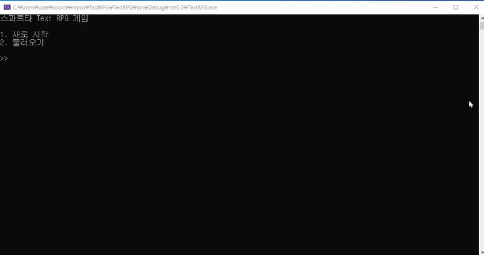  

### 상점 - 아이템 구매
  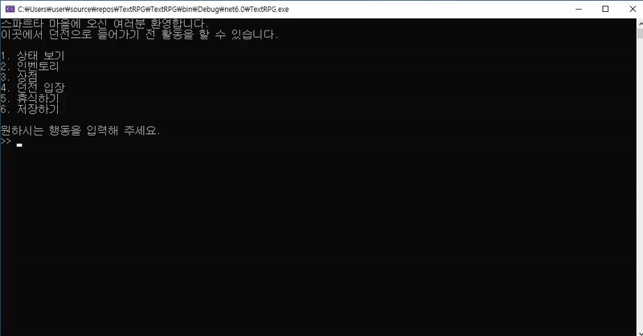  

### 상점 - 아이템 판매
  - **아이템 판매**  
    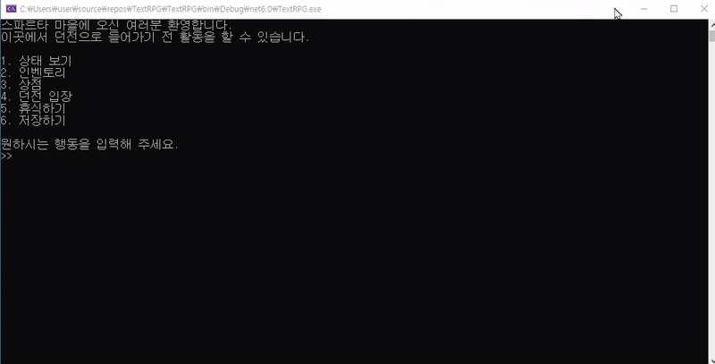
    
  - **장착 아이템 판매 시 장착 해제**
    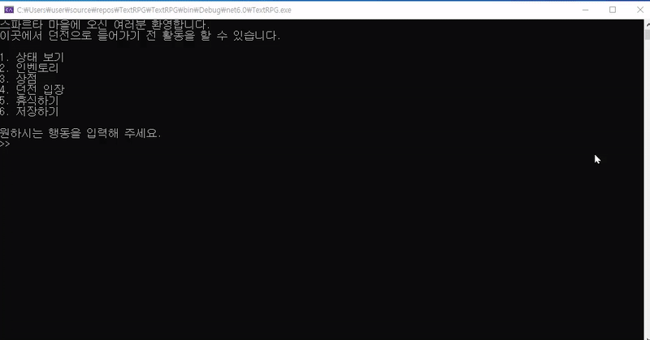  

### 장비 관리
  - **장비 장착 - 각 타입별로 하나의 아이템만 장착**  
    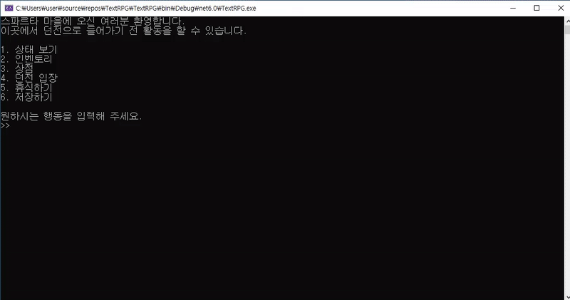  

  - **장착 해제**  
    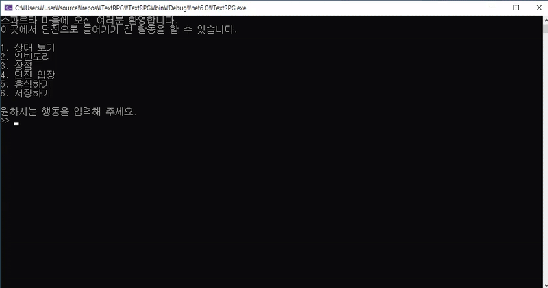

### 던전
  - **던전 실패**   
    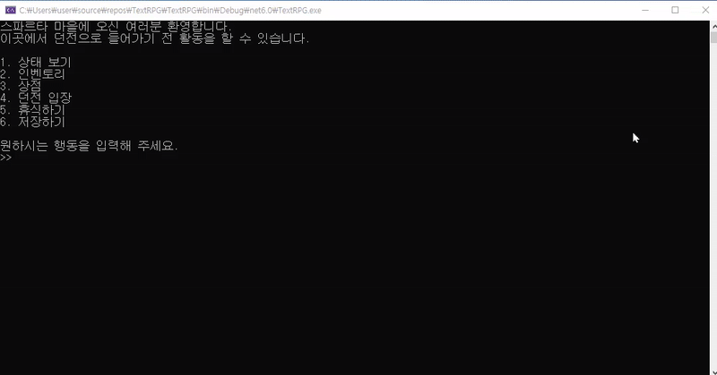
    
  - **던전 성공**   
    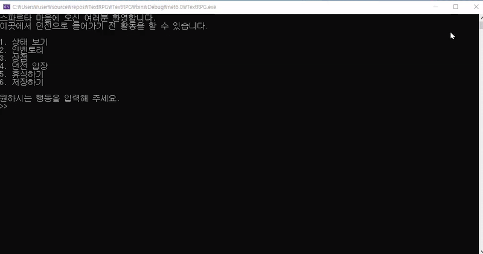  

### 휴식하기
  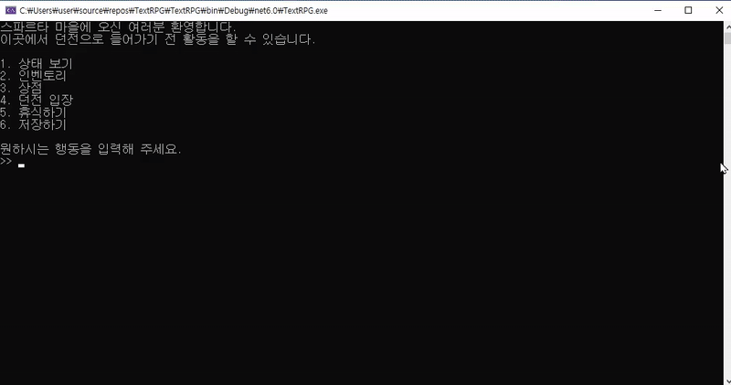  

### 저장하기
  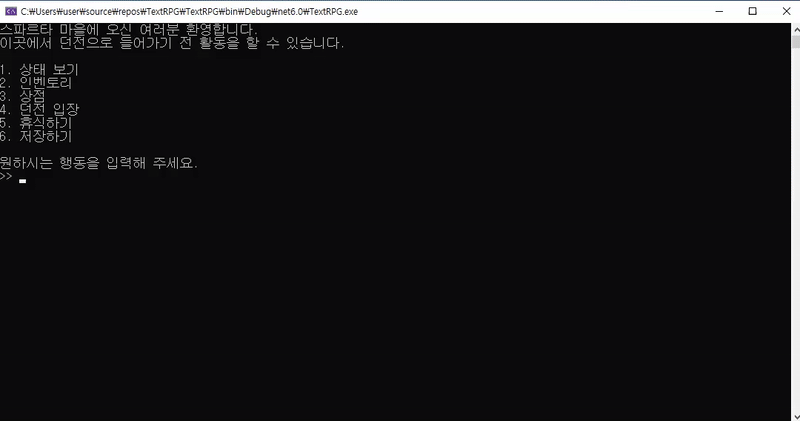  

### 불러오기
  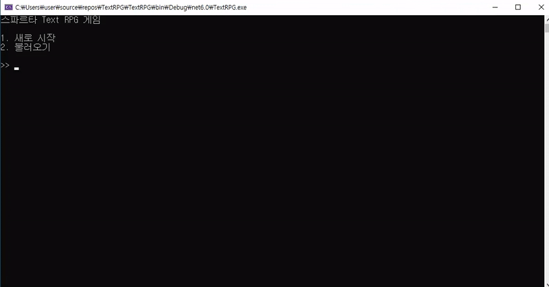  

## 게임의 특징  
- **상호작용**과 **전략적 선택**을 통해 캐릭터를 성장시킬 수 있습니다.  
- **장비 관리**와 **던전 탐험**을 통해 **Gold**를 모은 후, **상점**에서 더 강력한 아이템을 구매할 수 있습니다.  
- 흥미로운 **도전**과 **보상**이 가득한 RPG 경험을 제공합니다!
